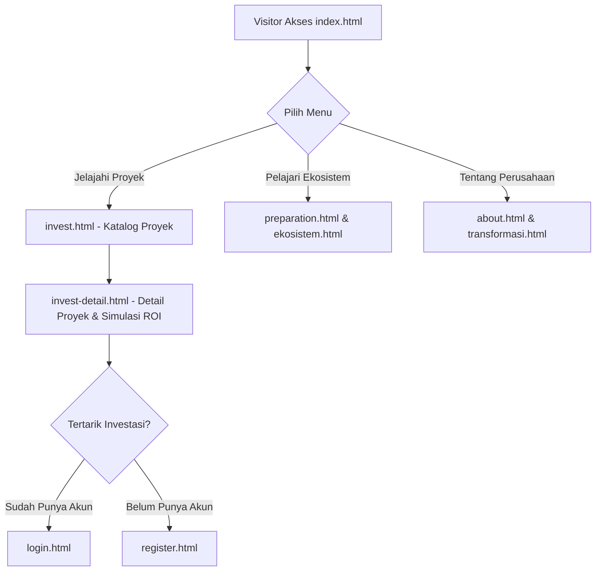
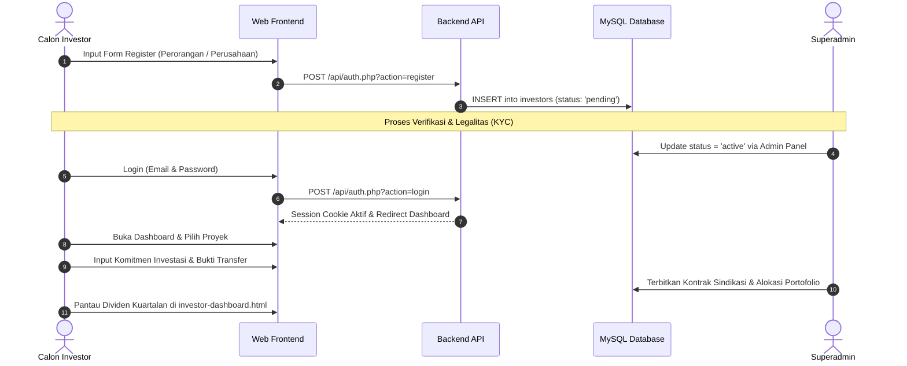

# 📑 Analisa Komprehensif Landing Page & Sistem Web PT Montana Global Investama (MGI)

Dokumen ini menyajikan analisa arsitektur, teknologi, keamanan, alur kerja sistem (*user & business flow*), serta daftar akun dan data *dummy* untuk keperluan pengujian dan audit sistem.

---

## 1. 🛠️ Tech Stack (Teknologi yang Digunakan)

Sistem landing page dan portal investor PT Montana Global Investama dibangun dengan arsitektur **Hybrid Client-Server (Decoupled Frontend-Backend with RESTful API & Server-Rendered Admin Dashboard)**:

### A. Frontend (Landing Page & Investor Portal)
* **HTML5 & Semantic Markup**: Halaman publik responsif (`index.html`, `about.html`, `invest.html`, `invest-detail.html`, `ekosistem.html`, `transformasi.html`, `preparation.html`, `contact.html`, `login.html`, `register.html`, `investor-dashboard.html`).
* **CSS Framework & Styling**:
  * **Bootstrap 5.3.3**: Grid system, modal, dropdown, dan form control.
  * **Bootstrap Icons 1.11.3**: Iconset antarmuka.
  * **Google Fonts**: *Outfit* (Heading) & *Inter* (Body/UI font).
  * **Custom Vanilla CSS (`assets/css/style.css`)**: Brand identity solid (*Deep Royal Blue* `#0F2C59`, *Champagne Gold* `#C5A059`, tanpa gradient norak sesuai kaidah *corporate finance*).
* **JavaScript (Vanilla ES6+)**:
  * `assets/js/components.js`: Dynamic component renderer (Global Navbar & Footer, sesi login/logout client-side).
  * `assets/js/api.js`: API client wrapper untuk komunikasi AJAX/Fetch ke backend.
  * `assets/js/main.js`: Interaktivitas umum, tab filter proyek, kalkulator simulasi ROI.
  * `assets/js/diagrams.js`: Engine visualisasi alur ekosistem, matriks transformasi, dan siklus modal kerja.

### B. Backend & REST API
* **Bahasa Pemrograman**: PHP 8.x (Native / Procedural + OOP Helpers terstruktur tanpa framework berat untuk kecepatan eksekusi tinggi).
* **REST API Layer (`/api/`)**:
  * `api/auth.php`: Autentikasi, registrasi, validasi sesi, CSRF token generation.
  * `api/projects.php`: Pengambilan daftar proyek, filter kategori, detail proyek, dan kalkulasi pendanaan.
  * `api/company-profile.php`, `api/ekosistem.php`, `api/transformasi.php`, `api/preparation.php`: Penyedia konten dinamis untuk landing page.
  * `api/investor/`: Endpoint dashboard investor (portofolio, dividen/payouts, rekening bank, mutasi).
  * `api/admin/`: Endpoint manajemen proyek, approval investor, dan pengaturan sistem.
* **Admin Dashboard (`/admin/`)**:
  * PHP Server-Side Rendering terproteksi sesi admin (`index.php`, `projects.php`, `investors.php`, `content.php`, `settings.php`).

### C. Database & Penyimpanan
* **Database Management System**: **MySQL / MariaDB** (InnoDB Engine).
* **Konektivitas**: PHP **PDO (PHP Data Objects)** dengan *Prepared Statements* dan mekanisme *Adaptive Port Detection* (otomatis mendeteksi port default XAMPP `3307` atau `3306`).
* **Format Data Transisi**: Fallback JSON di direktori `/data/` untuk sinkronisasi awal dan kompatibilitas statis.

---

## 2. 🛡️ Aspek Keamanan (Security Architecture)

Sistem telah dilengkapi dengan lapisan keamanan berstandar industri perbankan/fintech untuk mencegah celah umum OWASP:

| Komponen Keamanan | Implementasi pada Kode | Keterangan & Proteksi |
| :--- | :--- | :--- |
| **Password Hashing** | `password_hash($pass, PASSWORD_BCRYPT, ['cost' => 10])` | Mencegah kebocoran password *plaintext*; menggunakan salt otomatis kuat. |
| **SQL Injection Prevention** | PDO Prepared Statements (`$stmt->prepare()` & `$stmt->execute([...])`) | Parameter query dipisahkan penuh dari logika SQL (`PDO::ATTR_EMULATE_PREPARES => false`). |
| **CSRF Protection** | `getCsrfToken()` & `validateCsrfToken()` | Token kriptografis 64-karakter (`bin2hex(random_bytes(32))`) pada request POST/PUT/DELETE. |
| **Session Hardening** | `session_set_cookie_params()` | Atribut cookie `HttpOnly` (kebal XSS cookie theft), `SameSite=Lax` (anti-CSRF), dan adaptif `Secure` (HTTPS). |
| **Brute Force & Rate Limiting** | `checkRateLimit($action, $ip, $max, $decay)` | Membatasi percobaan login/request per IP dalam kurun waktu tertentu (database table `rate_limits`). |
| **Role-Based Access Control (RBAC)** | `requireAdminAuth()` & `requireInvestorAuth()` | Pemisahan hak akses ketat antara admin backoffice (`admin_users`) dan pemodal publik (`investors`). |
| **XSS Filtering** | `htmlspecialchars(strip_tags(...))` & Sanitasi Input | Membersihkan seluruh input form sebelum disimpan dan dirender. |
| **Audit Logging** | `logActivity($actorType, $actorId, $action, $desc)` | Mencatat setiap aktivitas krusial (login, ganti status proyek, verifikasi KYC) ke tabel `activity_logs`. |

---

## 3. 🔄 Alur Sistem (Website Workflow)

### A. Alur Publik & Landing Page (*Visitor Journey*)

1. **Eksplorasi**: Pengunjung membaca profil MGI, legalitas, struktur sinergi antar entitas (*Montana Group, MIU, Mypurcase*), dan melihat katalog proyek aset produktif (alat berat, armada logistik).
2. **Kalkulator Simulasi**: Pada `invest-detail.html`, calon investor dapat mensimulasikan nominal modal vs estimasi dividen/imbal hasil per kuartal.
3. **Konversi**: Tombol "Mulai Investasi" mengarahkan visitor untuk mendaftar akun atau login.

---

### B. Alur Registrasi, Verifikasi (KYC), & Investasi (*Investor Flow*)

---

### C. Alur Manajemen Backoffice (*Admin Flow*)
1. Admin login di `/admin/login.php`.
2. **Dashboard Overview (`/admin/index.php`)**: Memantau Total AUM, jumlah investor aktif, dana terkumpul, dan grafik pertumbuhan.
3. **Manajemen Proyek (`/admin/projects.php`)**: Tambah kampanye pendanaan baru, upload foto unit/alat berat, atur target dana, dan rilis *Campaign Progress Update*.
4. **Verifikasi Investor (`/admin/investors.php`)**: Validasi data KTP/NPWP, kelayakan investor perorangan/korporasi, dan rekening bank penampung dividen.
5. **Konten Landing Page (`/admin/content.php`)**: Memperbarui teks hero section, statistik AUM publik, dan informasi kontak.

---

## 4. 🛡️ Autentikasi Superadmin & Multi-Factor Authentication (MFA)

Untuk menjamin keamanan tingkat tinggi setara perbankan/fintech, portal administrasi kini dilengkapi dengan **MFA berbasis Google Authenticator (RFC 6238 TOTP)**:

### A. Kredensial Super Administrator (Fresh & Clean State)
* **URL Login**: `http://localhost/Montana-Global-Investama-Landing-page/admin/login.php` (atau URL VPS domain Anda)
* **Username**: `admin`
* **Email**: `admin@montanaglobalinvestama.com`
* **Password**: `Montana@2026!Secure`
* **MFA Status**: **Wajib Scan QR Code** saat login pertama kali.

### B. Mekanisme Kerja Google Authenticator MFA
1. **Tahap 1**: Admin memasukkan username & kata sandi yang valid.
2. **Tahap 2**:
   - Jika admin belum pernah setup MFA, sistem langsung menghasilkan secret key dan merender **QR Code dinamis** di layar.
   - Buka aplikasi **Google Authenticator** di HP, klik tombol `+`, pilih **Scan a QR code**, dan arahkan ke layar.
   - Masukkan **6 digit kode OTP** yang berputar setiap 30 detik.
3. **Tahap 3**: Setelah diverifikasi, secret terkunci aman di database (`mfa_enabled = 1`) dan sesi admin resmi diizinkan masuk ke Dashboard.

---

## 5. 🧹 Status Pembersihan Data (Clean Production State)

Seluruh data demo dan akun dummy telah dihapus bersih (*purged*) dari database:
* **Tabel `investors`**: KOSONG (0 data pemodal demo dihapus).
* **Tabel `investor_companies`**: KOSONG (0 profil PT demo dihapus).
* **Tabel `investor_bank_accounts`**: KOSONG (0 rekening demo BCA/Mandiri dihapus).
* **Tabel `investor_portfolios`**: KOSONG (0 kontrak investasi sindikasi dummy dihapus).
* **Tabel `projects`, `project_details`, `funding_items`, `project_simulation`**: KOSONG (Siap diisi proyek riil pertama oleh Superadmin).
* **Tabel `campaign_updates` & `admin_logs`**: KOSONG (Riwayat dibersihkan).

Sistem siap 100% untuk deployment ke Hostinger VPS menggunakan container Docker.

---

## 6. 🚀 Kesiapan Docker & Hostinger VPS

Project telah dilengkapi file konfigurasi container siap deploy:
* **[`Dockerfile`](file:///c:/xampp/htdocs/Montana-Global-Investama-Landing-page/Dockerfile)**: Image PHP 8.2 Apache dengan ekstensi `pdo`, `pdo_mysql`, `gd`, dan Apache rewrite module.
* **[`docker-compose.yml`](file:///c:/xampp/htdocs/Montana-Global-Investama-Landing-page/docker-compose.yml)**: Orkestrasi otomatis service web app dan MySQL 8.0 dengan volume persisten data.
* **[`DOCKER_DEPLOYMENT_GUIDE.md`](file:///c:/xampp/htdocs/Montana-Global-Investama-Landing-page/DOCKER_DEPLOYMENT_GUIDE.md)**: Panduan langkah demi langkah menjalankan project di Hostinger VPS.

